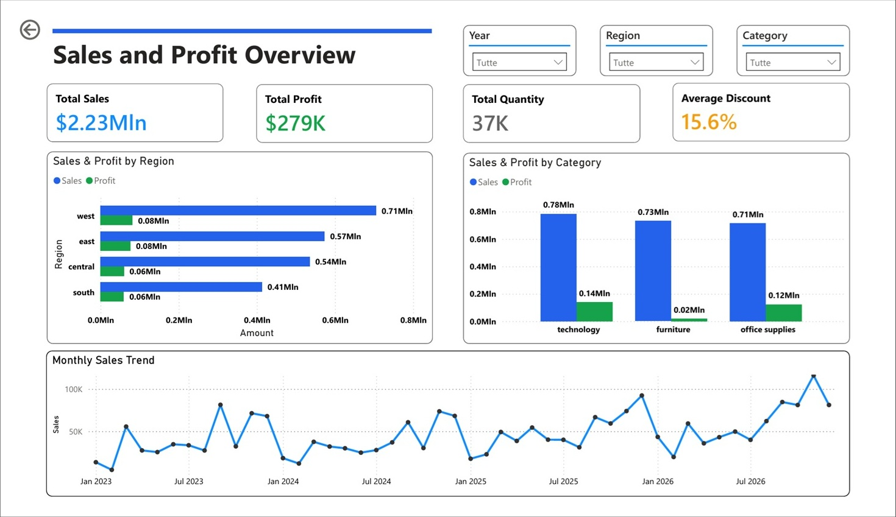
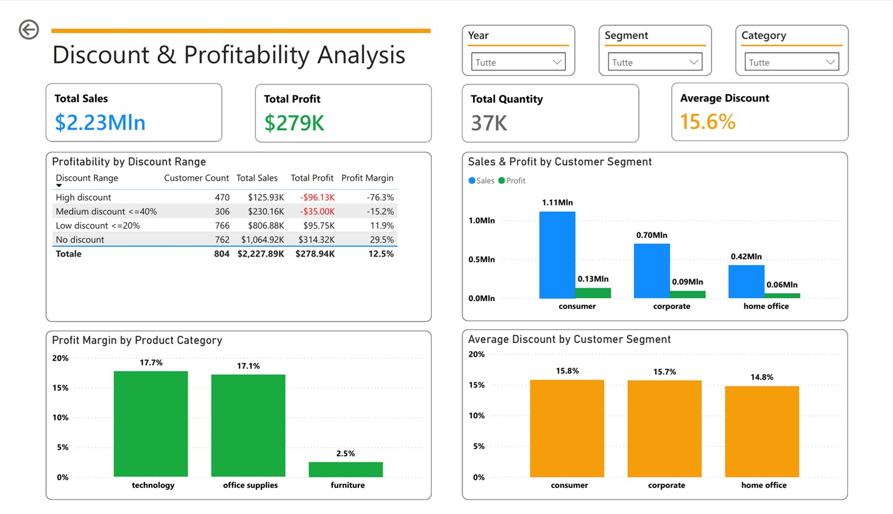

## ----------- ENGLISH -----------

# Dashboard Insights

## Business Problem

The business question behind this project is whether the discount strategy is contributing to sales while reducing overall profitability.

The analysis focuses on four main objectives:

- identify unprofitable or low-profit regions;
- identify product categories with critical margins;
- understand how many customers are involved in transactions across different discount ranges;

## Dashboard Pages

The Power BI report is organized into two pages:

1. **Sales and Profit Overview**
2. **Discount & Profitability Analysis**

The first page provides a general overview of sales, profit, quantity, average discount, regional performance, category performance and monthly sales trend.

The second page focuses on discount levels, profitability, product margins and customer segments.

## Power BI Dashboard

### Sales and Profit Overview



### Discount & Profitability Analysis



*The full dashboard is available here:*

[Download the dashboard](../powerbi/superstore_sales_dashboard.pbix)

*And also available as PDF:*

[Download the dashboard PDF](../powerbi/dashboard_screenshot/superstore_sales_dashboard.pdf)

## Key Measures

The main DAX measures used in the dashboard are:

```DAX
Total Sales = SUM(FACT_Sales[sales])

Total Profit = SUM(FACT_Sales[profit])

Total Quantity = SUM(FACT_Sales[quantity])

Average Discount = AVERAGE(FACT_Sales[discount])

Customer Count = DISTINCTCOUNT(FACT_Sales[customer_id])

Profit Margin = DIVIDE([Total Profit], [Total Sales])
```

The Profit Margin measure was calculated as the ratio between total profit and total sales.

DIVIDE was used to safely handle possible division-by-zero cases.

### Discount Range Calculation

To analyze the impact of discounts on profitability, each transaction was assigned to a discount range using a calculated column in Power BI.

```DAX
Discount Range =
SWITCH(
    TRUE(),
    FACT_Sales[discount] = 0, "No discount",
    FACT_Sales[discount] <= 0.20, "Low discount <=20%",
    FACT_Sales[discount] <= 0.40, "Medium discount <=40%",
    "High discount"
)
```

A second calculated column was created to sort the discount ranges in a logical order instead of alphabetical order.

```DAX
Discount Range Sort =
SWITCH(
    TRUE(),
    FACT_Sales[discount] = 0, 1,
    FACT_Sales[discount] <= 0.20, 2,
    FACT_Sales[discount] <= 0.40, 3,
    4
)
```

The Discount Range column was then sorted by Discount Range Sort.

The resulting order is:

No discount
Low discount <=20%
Medium discount <=40%
High discount

The discount range analysis was used to compare customer count, total sales, total profit and profit margin across different discount levels.

#### Main Findings
1. Regional Profitability

No region appears to be overall unprofitable.

However, the dashboard shows that South and Central generate lower total profit compared to West and East.

This suggests that regional performance should be monitored, even if no region is currently producing a total loss.

2. Product Category Margins

The Profit Margin by Product Category visual highlights a clear difference between categories.

Technology shows the highest profit margin, around 17.7%.
Office Supplies also performs well, with a profit margin around 17.1%.
Furniture shows a much weaker profit margin, around 2.5%.

This makes Furniture the most critical category from a profitability perspective.

Although Furniture may contribute to sales volume, its margin is significantly lower than the other categories.

3. Discount Range Profitability

The Profitability by Discount Range table directly addresses the main business concern.

The analysis shows a strong relationship between higher discount levels and lower profitability:

No discount generates the highest profit and margin.
Low discount still generates positive profit, but with a lower margin.
Medium discount generates negative profit.
High discount generates a significant loss.

From the dashboard:

Discount Range          | Sales	    | Profit    | Profit Margin
No discount	            | $1.06M	| $314.32K  |	  29.5%
Low discount <=20%	    | $806.88K	| $95.75K	|     11.9%
Medium discount <=40%	| $230.16K	| -$35.00K	|    -15.2%
High discount	        | $125.93K	| -$96.13K	|    -76.3%

This suggests that high discount levels are strongly associated with margin erosion.

4. Customers and Discount Ranges

The discount range table also includes a customer count by discount range.

This does not mean that each customer belongs exclusively to one discount range. A customer can appear in more than one discount range if they made purchases with different discount levels.

The metric should therefore be interpreted as:

*number of customers involved in transactions within each discount range.*

This is still useful because it shows how many customers are exposed to each discount level and how those discount levels impact sales and profit.

## Business Interpretation

The dashboard supports the initial management concern.

Discounted transactions contribute to sales volume, but medium and high discount ranges are associated with negative profit and poor margins.

The main commercial risk is that discounting may be used too aggressively, especially when discounts exceed 20%.


## ----------- ITALIANO -----------

# Insight della Dashboard

## Problema di Business

La domanda alla base del progetto è capire se la strategia di sconti stia contribuendo alle vendite ma riducendo la marginalità complessiva.

L'analisi si concentra su quattro obiettivi principali:

- identificare regioni in perdita o con basso profitto;
- identificare categorie prodotto con margini critici;
- capire quanti clienti sono coinvolti in transazioni appartenenti a diverse fasce di sconto;

## Pagine della Dashboard

Il report Power BI è organizzato in due pagine:

1. **Sales and Profit Overview**
2. **Discount & Profitability Analysis**

La prima pagina fornisce una panoramica generale su vendite, profitto, quantità, sconto medio, performance regionali, performance per categoria e andamento mensile delle vendite.

La seconda pagina si concentra su livelli di sconto, redditività, marginalità per categoria e segmenti cliente.

## Power BI Dashboard

### Sales and Profit Overview


### Discount & Profitability Analysis


*La dashboard completa è disponibile qui:*

[Download the dashboard](../powerbi/superstore_sales_dashboard.pbix)

*Disponibile anche come PDF:*

[Download the dashboard PDF](../powerbi/dashboard_screenshot/superstore_sales_dashboard.pdf)

## Misure Principali

Le principali misure DAX utilizzate nella dashboard sono:

```DAX
Total Sales = SUM(FACT_Sales[sales])

Total Profit = SUM(FACT_Sales[profit])

Total Quantity = SUM(FACT_Sales[quantity])

Average Discount = AVERAGE(FACT_Sales[discount])

Customer Count = DISTINCTCOUNT(FACT_Sales[customer_id])

Profit Margin = DIVIDE([Total Profit], [Total Sales])
```

La misura Profit Margin è stata calcolata come rapporto tra profitto totale e vendite totali.

La funzione DIVIDE è stata usata per gestire in modo sicuro eventuali casi di divisione per zero.

## Calcolo delle Fasce di Sconto

Per analizzare l'impatto degli sconti sulla redditività, ogni transazione è stata assegnata a una fascia di sconto tramite una colonna calcolata in Power BI.

```DAX
Discount Range =
SWITCH(
    TRUE(),
    FACT_Sales[discount] = 0, "No discount",
    FACT_Sales[discount] <= 0.20, "Low discount <=20%",
    FACT_Sales[discount] <= 0.40, "Medium discount <=40%",
    "High discount"
)
```

È stata poi creata una seconda colonna calcolata per ordinare le fasce di sconto in modo logico, evitando l'ordinamento alfabetico.

```DAX
Discount Range Sort =
SWITCH(
    TRUE(),
    FACT_Sales[discount] = 0, 1,
    FACT_Sales[discount] <= 0.20, 2,
    FACT_Sales[discount] <= 0.40, 3,
    4
)
```

La colonna Discount Range è stata ordinata usando la colonna Discount Range Sort.

L'ordine finale delle fasce è:

No discount
Low discount <=20%
Medium discount <=40%
High discount

L'analisi per fascia di sconto è stata usata per confrontare numero clienti, vendite totali, profitto totale e margine di profitto nei diversi livelli di sconto.

#### Risultati Principali
1. Redditività per Regione

Non emergono regioni complessivamente in perdita.

Tuttavia, la dashboard mostra che South e Central generano un profitto totale più basso rispetto a West ed East.

Questo suggerisce che la performance regionale debba essere monitorata, anche se nessuna regione produce attualmente una perdita complessiva.

2. Marginalità per Categoria Prodotto

Il visual Profit Margin by Product Category evidenzia una differenza chiara tra le categorie.

Technology mostra il margine più alto, circa 17,7%.
Office Supplies performa bene, con un margine di circa 17,1%.
Furniture mostra un margine molto più debole, circa 2,5%.

Questo rende Furniture la categoria più critica dal punto di vista della redditività.

Anche se Furniture può contribuire al volume di vendita, il suo margine è significativamente più basso rispetto alle altre categorie.

3. Redditività per Fascia di Sconto

La tabella Profitability by Discount Range risponde direttamente al problema business principale.

L'analisi mostra una forte relazione tra livelli di sconto più alti e minore redditività:

No discount genera il profitto e il margine più alti.
Low discount genera ancora profitto positivo, ma con un margine più basso.
Medium discount genera profitto negativo.
High discount genera una perdita significativa.

Dalla dashboard:

Discount Range          | Sales	    | Profit    | Profit Margin
No discount	            | $1.06M	| $314.32K  |	  29.5%
Low discount <=20%	    | $806.88K	| $95.75K	|     11.9%
Medium discount <=40%	| $230.16K	| -$35.00K	|    -15.2%
High discount	        | $125.93K	| -$96.13K	|    -76.3%

Questo suggerisce che gli sconti elevati siano fortemente associati all'erosione della marginalità.

4. Clienti e Fasce di Sconto

La tabella per fascia di sconto include anche il conteggio clienti.

Questo non significa che ogni cliente appartenga esclusivamente a una sola fascia di sconto. Uno stesso cliente può comparire in più fasce se ha effettuato acquisti con livelli di sconto diversi.

La metrica va quindi interpretata come:

*numero di clienti coinvolti in transazioni appartenenti a ciascuna fascia di sconto.*

È comunque un'informazione utile, perché mostra quanti clienti sono esposti a ciascun livello di sconto e quale impatto hanno queste fasce su vendite e profitto.

## Interpretazione Business

La dashboard supporta il sospetto iniziale del management.

Le transazioni scontate contribuiscono al volume di vendita, ma le fasce di sconto medio e alto sono associate a profitto negativo e margini deboli.

Il principale rischio commerciale è che gli sconti vengano usati in modo troppo aggressivo, soprattutto quando superano il 20%.